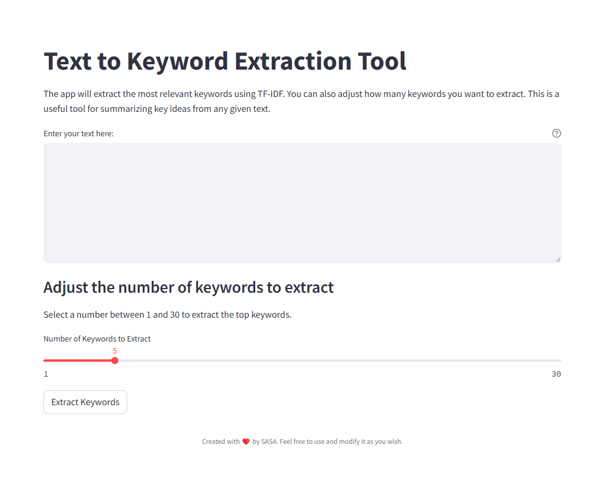

# Text to Keyword Extraction Tool

This is a Python-based web application that extracts keywords from a given text using the TF-IDF (Term Frequency-Inverse Document Frequency) technique. The tool utilizes Natural Language Processing (NLP) to clean and tokenize text, remove stopwords, and then compute the most relevant keywords based on their importance.

### Features
- **Text Input**: User can input any text and extract keywords.
- **Adjustable Keyword Count**: Allows extraction of up to 30 keywords.
- **User-Friendly Interface**: Simple and clean UI built with Streamlit.
- **Stopwords Removal**: Automatically removes common stopwords (e.g., "is", "and", "the") from the text to focus on more meaningful words.

### Requirements
To run this app, you need to have the following installed:
- Python 3.6 or higher
- Required Python libraries:
    - `nltk`
    - `streamlit`
    - `sklearn`

### Installation
### Clone the repository
git clone https://github.com/your-username/text-to-keyword-extraction.git

### Navigate to the project directory
cd text-to-keyword-extraction

### Install the required dependencies
pip install -r requirements.txt

### Run the Streamlit app
streamlit run app.py 
Or
python -m streamlit run keyword_generator_app.py

